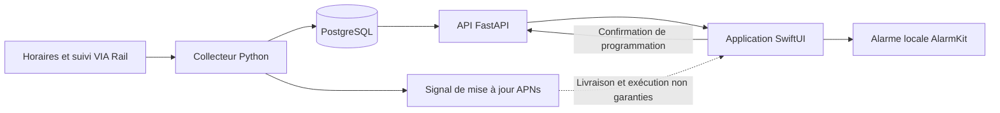

# Plan — Réveil iPhone selon le suivi VIA Rail

Plan préparé le 13 septembre et révisé le 14 septembre 2026 après trois revues indépendantes. Il propose le travail à réaliser; aucune fonctionnalité décrite ci-dessous n’est encore implémentée. Les preuves et limites de la recherche sont consignées dans [VALIDATION.md](VALIDATION.md).

**Objectif proposé :** choisir un train, sa date de départ et une gare, puis demander « Réveille-moi 15 minutes avant mon arrivée ». L’application suit les estimations de VIA Rail et programme une alarme sur l’iPhone.

**Décision actuelle : poursuivre un prototype de faisabilité.** Le choix d’AlarmKit est fondé. L’ajustement automatique pendant le sommeil doit encore être mesuré. Une alarme fondée sur une heure sauvegardée avec reports manuels est une solution de repli, dont l’utilité doit être évaluée séparément de l’objectif adaptatif.

Hypothèse de départ : le premier usage est le réveil à bord avant la gare d’arrivée. Le réveil à domicile avant de prendre le train est décrit à la fin et doit être confirmé avant de figer le périmètre.

**Ce qui est déjà vérifié**

- Le dépôt contient une application FastAPI avec une route « Hello World », un test et une CI. Il ne contient ni application iOS, ni connexion VIA Rail, ni gestion des alarmes.
- VIA Rail publie ses horaires au format GTFS. Cela fournit la base des trajets planifiés, distincte du suivi en direct. [Ressources développeurs VIA Rail](https://www.viarail.ca/fr/ressources-developpeurs)
- Le site de suivi officiel utilise un fichier JSON public. Deux lectures le 14 septembre, à 11 h 15 et 11 h 18 UTC, ont répondu HTTP 200 avec 65 trajets chacune. Les observations du train (`poll`) disponibles dataient d’environ une à quatre minutes; aucun horodatage propre à chaque prévision d’arrêt n’a été identifié. [Site officiel](https://tsimobile.viarail.ca/index-fr.html), [flux observé](https://tsimobile.viarail.ca/data/allData.json)
- Un désaccord de desserte a été vérifié pour le train 26 du 14 septembre : Coteau figure dans les deux lectures du suivi, mais pas dans le trajet GTFS actif ce lundi. Aucune exception de calendrier ne résout ce cas. Les preuves sont détaillées dans la validation; on ne sait pas laquelle des sources décrit correctement la desserte.
- Aucune licence ni contrat d’API temps réel équivalent au GTFS n’a été trouvé. Les conditions générales du site contiennent des restrictions d’usage, notamment commercial. Avant une collecte récurrente ou une bêta utilisant le flux, établir les conditions applicables à la collecte, au cache et à la redistribution; ne pas étendre la licence GTFS au JSON. [Conditions VIA](https://www.viarail.ca/en/terms-and-conditions)
- AlarmKit, disponible à partir d’iOS 26, permet de programmer des alarmes qui passent le mode silencieux et les modes de concentration, après autorisation de l’utilisateur. [Présentation Apple](https://developer.apple.com/videos/play/wwdc2025/230/)
- Apple ne garantit pas la livraison des notifications silencieuses et choisit quand exécuter les tâches de rafraîchissement. Un serveur ne peut donc pas être considéré comme capable de modifier ponctuellement une alarme à tout moment sur un iPhone endormi. [Notifications en arrière-plan](https://developer.apple.com/documentation/usernotifications/pushing-background-updates-to-your-app), [tâches en arrière-plan](https://developer.apple.com/documentation/backgroundtasks/choosing-background-strategies-for-your-app)

**Première version proposée**

Le prototype utilise un seul trajet actif, sur iPhone avec iOS 26 ou ultérieur. La bêta éventuelle sera limitée à des trains et arrêts qualifiés du corridor Québec–Windsor; la concordance de quelques trajets dans un échantillon ne valide pas tout le corridor.

Le parcours comprend quatre étapes :

1. Rechercher un train par numéro et date, puis vérifier son origine et sa destination pour distinguer les départs qui portent le même numéro.
2. Choisir une gare à venir et une avance de réveil, par exemple 10, 15 ou 30 minutes.
3. Voir l’arrivée estimée, l’ancienneté des données et l’heure d’alarme proposée, puis activer le réveil.
4. Voir l’heure effectivement enregistrée sur l’iPhone, les changements proposés et les actions pour modifier ou arrêter le réveil.

La confirmation « Alarme activée à 14 h 05 » apparaît uniquement après réussite de la programmation dans AlarmKit. Au relancement et lors des occasions d’exécution, relire l’autorisation et les alarmes présentes avant d’afficher l’état actuel. Une ancienne confirmation locale, un enregistrement côté serveur ou l’acceptation d’un push par Apple ne prouve pas cet état actuel. [AlarmManager](https://developer.apple.com/documentation/alarmkit/alarmmanager)

Prévoir un état lisible lorsque le suivi est indisponible, que les autorisations sont refusées ou qu’une modification attend encore son application sur l’iPhone. Afficher l’heure vérifiée ou, si la vérification échoue, la dernière confirmation datée avec un état actuel inconnu.

Le premier prototype utilise une sonnerie système et une alarme simple, sans compte à rebours ni répétition après sonnerie. Apple exige une extension Widget pour une présentation avec compte à rebours. Les comptes utilisateurs, la carte détaillée, l’import de billets et les correspondances sont différés. La localisation du téléphone est une variante de faisabilité à examiner pour l’usage à bord. [Exemple AlarmKit](https://developer.apple.com/documentation/alarmkit/scheduling-an-alarm-with-alarmkit)

**Règle de réveil et comportement en cas de problème**

L’objectif adaptatif calcule l’heure souhaitée à partir de l’arrivée estimée à la gare choisie, moins l’avance demandée. Le prototype compare ce résultat à une règle prudente : `min(arrivée planifiée, estimation exploitable) − avance`, lorsque les deux heures concernent sans ambiguïté le même arrêt et le même trajet. Avec seulement l’horaire planifié, l’indiquer explicitement. Avec seulement une ETA, ne pas qualifier le résultat de repli prudent.

Cette règle initiale réduit le risque d’armer trop tard sur une ETA déjà retardée. Elle ne protège pas contre toute arrivée anticipée. Si le repère prudent est déjà passé, expliquer ce résultat avant activation et laisser choisir explicitement une nouvelle heure; ne jamais reporter implicitement au lendemain. La règle prudente reste une proposition de prototype, pas un choix utilisateur déjà confirmé.

| Situation | Comportement proposé |
| --- | --- |
| Activation du réveil | Programmer immédiatement une alarme locale et conserver sa date, son identifiant et la version du calcul. |
| Nouvelle estimation plus tôt | Avancer l’alarme dès que l’application peut appliquer la mise à jour. Si l’heure calculée est passée et que des données exploitables confirment une gare à venir, demander une seule alarme au plus tôt selon la procédure validée. Si l’état est inconnu ou la gare passée, ne pas promettre un réveil avant arrivée. |
| Nouvelle estimation plus tard | Pour le MVP prudent, proposer le report et conserver l’heure déjà enregistrée jusqu’à confirmation. Un report automatique exige une décision produit distincte et des essais sur appareil. |
| Application suspendue ou sans réseau | L’alarme déjà programmée reste le recours. Une mise à jour serveur ne modifie pas à elle seule cette heure. |
| Données anciennes, invalides ou reçues dans le désordre | Conserver la dernière programmation valide, afficher l’ancienneté connue et rejeter les calculs fondés sur ces nouvelles données. |
| Échec d’une reprogrammation | Viser la conservation d’une alarme existante et relire ce qui subsiste après erreur. Ne présumer ni remplacement atomique ni conservation automatique. Tester l’interruption entre programmation, persistance et annulation. |
| Horaires et suivi en désaccord | Conserver les deux provenances; ne pas sélectionner un autre calendrier parce qu’il ressemble au suivi. Ne pas proposer de réveil lié à cet arrêt tant que sa desserte n’est pas établie. |
| Train absent du flux | Le considérer comme indisponible, sans en déduire une annulation ou une arrivée. |
| Annulation ou gare non desservie confirmée | Avertir l’utilisateur et conserver un réveil d’information tant qu’il ne l’a pas désactivé. |
| Réveil arrêté par l’utilisateur | Enregistrer durablement l’arrêt et invalider la génération active; rejeter tout ancien message. Afficher l’annulation comme confirmée uniquement après vérification locale. |
| Passage de la gare confirmé, réveil terminé ou expiration | Terminer la génération selon une règle documentée, arrêter la collecte propre à ce suivi et réconcilier les alarmes restantes. Une ETA dépassée ne confirme pas le passage. Aucun ancien push ne doit réactiver ce réveil. |

Cette politique favorise un réveil éventuellement trop tôt. Elle ne garantit pas une avance constante sur l’arrivée réelle : VIA Rail précise qu’un train peut rattraper du retard, et une estimation d’arrivée antérieure à l’horaire était présente dans le flux observé. Une alarme restée sur une ancienne estimation peut donc devenir trop tardive. [Suivi officiel et limites des estimations](https://tsimobile.viarail.ca/index-fr.html)

Le prototype doit établir séparément la fiabilité de la sonnerie programmée et la fréquence réelle à laquelle l’iPhone applique les changements. Si un changement n’est pas appliqué avant l’échéance nécessaire, l’adaptation échoue pour cette configuration. Des essais réussis dans un périmètre peuvent justifier un produit aux limites explicites; ils ne créent pas une garantie de ponctualité universelle.

**Architecture recommandée**

Commencer par SwiftUI, AlarmKit, stockage local et rejeu de prévisions fictives. Un petit banc APNs suffit ensuite pour les essais d’actualisation. Construire le collecteur permanent, l’API complète et PostgreSQL après la décision de faisabilité. Le schéma suivant représente cette architecture de bêta conditionnelle.

- **iPhone :** SwiftUI, AlarmKit et stockage local du trajet et de la programmation confirmée. Utiliser des dates absolues pour les alarmes de voyage. Apple distingue les alarmes à date fixe des alarmes relatives au fuseau du téléphone. [Dates d’alarme](https://developer.apple.com/documentation/alarmkit/alarm/schedule-swift.enum/relative)
- **Serveur :** conserver FastAPI; actualiser les dépendances lors de l’implémentation. Un processus de collecte indépendant des requêtes HTTP interroge la source et normalise les données. Une instance de collecteur suffit pour la bêta.
- **Collecte :** viser initialement une lecture globale toutes les 30 à 60 secondes pendant les suivis actifs, sous réserve des conditions VIA et des mesures de fraîcheur. Partager le résultat entre les utilisateurs, appliquer un cache et espacer les essais après erreur. Cette cadence concerne le serveur, pas l’exécution de l’iPhone.
- **Mises à jour :** l’application récupère les changements lorsqu’elle est ouverte et lors des occasions d’exécution autorisées en arrière-plan. Apple recommande de ne pas dépasser deux ou trois notifications silencieuses par heure. Leur livraison et leur délai ne sont pas garantis. Une collecte chaque minute ne donne pas cette cadence sur iPhone. [Notifications en arrière-plan](https://developer.apple.com/documentation/usernotifications/pushing-background-updates-to-your-app)
- **Expériences complémentaires :** tester une session Core Location pendant un trajet réellement suivi, avec autorisation et indicateur système, pour déclencher localement une action à l’approche. La réception et la précision restent à mesurer; une distance ne garantit pas quinze minutes de trajet. Tester aussi, de façon bornée, si une Notification Service Extension peut lire et reprogrammer les alarmes de l’app principale après un push visible. Ce partage n’est pas établi par les documents consultés. Ni ces expériences ni une Live Activity ne constituent une solution acquise. [Localisation en arrière-plan](https://developer.apple.com/documentation/corelocation/handling-location-updates-in-the-background), [extension de notification](https://developer.apple.com/documentation/usernotifications/unnotificationserviceextension)
- **Persistance :** PostgreSQL pour les trajets suivis, les dernières estimations utiles et les versions de programmation. Pour le prototype de faisabilité, des fixtures et une base locale suffisent.
- **Accès :** identification anonyme de l’installation, authentification des modifications de ses réveils et protection des jetons APNs. Limiter la conservation des trajets et prévoir leur suppression. Si la variante localisation est retenue, la limiter au suivi activé par l’utilisateur et traiter les positions localement par défaut.

Le contrat de données distingue quatre objets :

| Objet | Informations essentielles |
| --- | --- |
| Trajet du train | Identifiant stable, numéro, date de départ à l’origine. Le numéro seul est insuffisant. |
| Prévision d’un arrêt | Code et ordre d’arrêt, arrivée et départ distincts, provenance des heures, fuseau, état de desserte et de concordance; collecte HTTP, observation du train et horodatage de prévision séparés, les deux derniers pouvant être inconnus. |
| Demande de réveil | Installation, trajet, arrêt cible, avance souhaitée, intention active ou arrêtée et génération invalidant les anciens messages. |
| Programmation | Heure souhaitée et révision; heure et identifiant observés dans AlarmKit, autorisation, date de vérification, révision appliquée et opération éventuelle en attente. |

Le champ `poll` ne date pas explicitement chaque prévision d’arrivée. Les seuils de péremption doivent distinguer observation ancienne et âge inconnu de la prévision. Un fichier téléchargé récemment n’est pas une preuve de fraîcheur métier.

Pour la jointure, filtrer `trip_short_name` par date de service, `calendar` et `calendar_dates`, puis relier les codes du suivi à `stops.stop_code` et enfin aux `stop_id` de `stop_times`. Vérifier l’ordre et la desserte sans cacher les désaccords. Respecter l’horizon `feed_info`, même si certains calendriers vont plus loin.

Normaliser les instants en UTC et conserver les fuseaux IANA. Les heures GTFS suivent le fuseau de l’agence et peuvent dépasser 24 h; les dates JSON portent leurs propres décalages. Ne pas appliquer indistinctement le fuseau de la gare aux deux formats, ni calculer depuis le texte `eta`. [Spécification GTFS](https://gtfs.org/documentation/schedule/reference/)

**Ordre de réalisation**

| Étape | Travail | Critère de sortie |
| --- | --- | --- |
| 1. Qualifier les données VIA | Établir les conditions d’usage, la jointure, les désaccords, les valeurs absentes et les limites de fraîcheur. Définir les trains et arrêts éligibles. | Source utilisable documentée et fixtures des anomalies; sinon poursuivre uniquement les simulations locales. |
| 2. Prototyper l’alarme locale | Petit projet SwiftUI, données fictives, dates absolues, remplacement, arrêt et réconciliation. Peut avancer indépendamment du jalon VIA. | Sonnerie observée sur iPhone et état fidèle après les échecs injectés. |
| 3. Prototyper l’actualisation | Mesurer sur plusieurs heures les corrections au premier plan et en veille; comparer APNs et variantes locales pertinentes. Borner l’essai d’extension à l’accès réel aux alarmes de l’app principale. | Délais, échecs et limites établis par configuration; distinguer programmation et sonnerie. |
| 4. Fixer le produit et le calendrier | Choisir le niveau d’adaptation, la règle de repli, les limites acceptables et les configurations prises en charge à partir des mesures. | Décision explicite sur la poursuite et réestimation du travail restant. Un prototype d’alarme fixe ne clôt pas l’objectif adaptatif. |
| 5. Construire le service et le parcours | Si justifiés, collecteur, persistance, API, recherche, programmation et arrêts; mettre à niveau l’outillage et le conteneur existants. | Identités et générations durables, récupération après redémarrage, aucun mélange de trajets ni résurrection de réveils. |
| 6. Bêta limitée | Préparer TestFlight et les essais sur trajets réels qualifiés, après résolution des conditions de données. | Mesurer sonneries, marge par rapport aux arrivées constatées et batterie avant d’élargir. |

Le calendrier de bêta sera estimé après les prototypes et la décision produit. Le dépôt actuel et cette recherche ne permettent pas de valider une durée de réalisation. Séparer effort de développement, délais d’accès aux données, essais de trajet et validation externe.

**Vérifications à prévoir pendant l’implémentation**

- Calculs : passage de minuit, fuseaux et changement d’heure, retard puis rattrapage, arrivée en avance, estimation invalide, train homonyme d’une autre date, gare déjà passée et arrêt annulé.
- Programmation : refus puis révocation d’autorisation, échec de remplacement, relancement pendant une modification, notifications reçues en double ou après arrêt du réveil.
- Appareil physique : écran verrouillé, silencieux, concentration Sommeil, économie d’énergie, mode avion, fermeture forcée, redémarrage avant premier déverrouillage et changement de sortie audio. Ajouter app masquée ou protégée par Face ID, alarme Horloge simultanée, boutons physiques et durée audible de la sonnerie. La FAQ DTS d’août 2025 signale plusieurs de ces limites; leur état doit être vérifié sur les versions ciblées. [FAQ AlarmKit](https://developer.apple.com/forums/thread/797158)
- Chaîne complète : une collecte réussie ou un push accepté ne prouve ni la programmation, ni la sonnerie. Mesurer ces étapes séparément; l’application ne peut pas affirmer que l’utilisateur s’est réveillé.

**Si le besoin prioritaire est le réveil avant de partir**

Le calcul devient : heure de départ du train à la gare d’embarquement, moins la préparation, le trajet jusqu’à la gare et la marge d’embarquement. Il faut utiliser la prévision de départ, qui peut différer de l’arrivée à cette gare. Le MVP conserverait une heure fondée sur le départ planifié et proposerait les reports liés aux retards, puisque VIA indique que du temps peut être rattrapé. Ce mode réutilise la même architecture, mais nécessite ses propres champs et règles avant le développement des écrans.

Les critères de poursuite et la matrice de preuves sont précisés dans [VALIDATION.md](VALIDATION.md). La prochaine étape est le prototype local de sonnerie et de reprogrammation, accompagné de la qualification des données.
