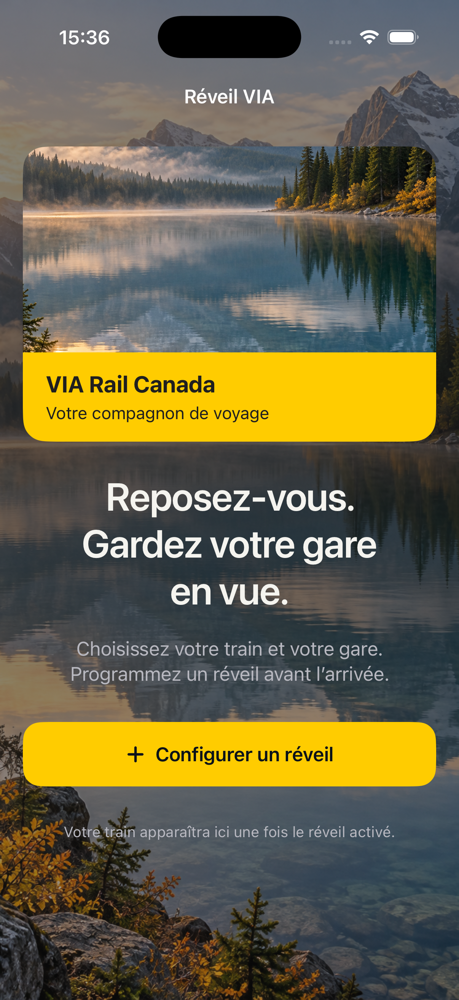
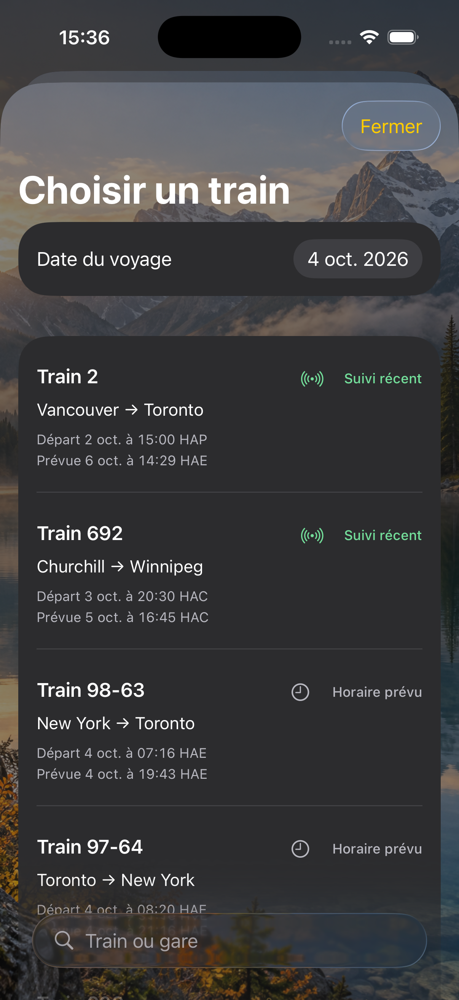
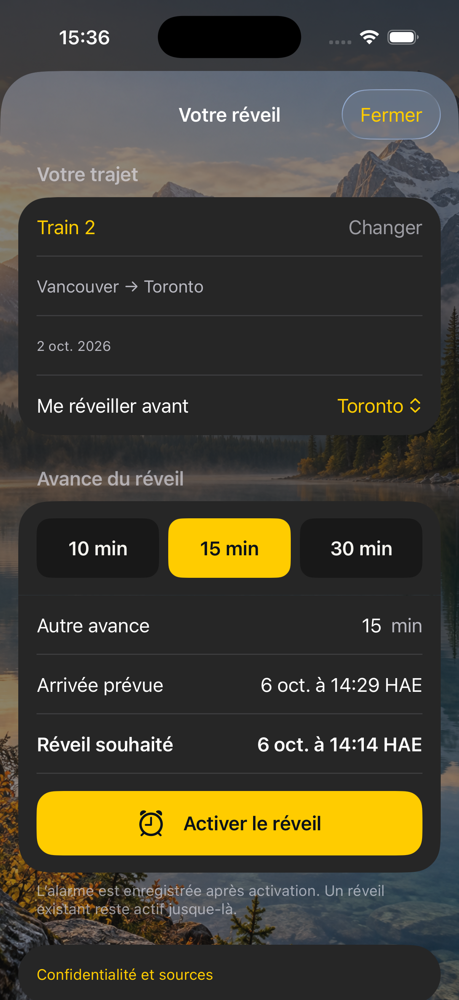

# VIA Wake · Réveil VIA

Rest easy. Keep your stop in sight.

An iPhone companion that helps you set an alarm before your VIA Rail Canada stop. Choose your train, destination station and how many minutes before arrival you want to wake up. Available in English and French.

## Screenshots

<p align="center">
  
  
  
</p>

Screenshots show the app in French on an iPhone 17 Pro simulator running iOS 26.1.

## Features

- Search trains and choose your station and alarm lead time.
- Local alarms with AlarmKit and lock screen updates with Live Activities.
- VIA schedules and arrival estimates, multi-day journeys and station time zones.
- Cached schedules for offline browsing.
- English and French, with no account, ads or backend to set up.

## Getting started

**Xcode 26.1+ · Swift 6.2 · iOS 26+**

```sh
git clone https://github.com/Justin2997/via-rail-notif.git
cd via-rail-notif
open ios/ReveilVIA.xcodeproj
```

Select the `ReveilVIA` scheme and an iPhone simulator. To run on a physical device, choose your signing team for both the app and its extension. No API key is required.

```sh
swift test --package-path ios
```

## Contributing

Issues and pull requests in English or French are welcome. See the [contribution guide](CONTRIBUTING.md), [security policy](SECURITY.md) and [privacy policy (English and French)](docs/PRIVACY.md).

## Status and credits

The app is in beta. Background updates depend on iOS, so tracking is not continuous. Alarm ringing on a physical iPhone still needs validation before distribution.

This is an independent app with no official affiliation with VIA Rail Canada. Schedule data: VIA Rail Canada Inc., under the [Open Government Licence – Canada](https://open.canada.ca/en/open-government-licence-canada). Terms of use for the live JSON feed remain to be confirmed. A code license has not yet been selected; ZIPFoundation retains its [MIT license](ios/App/ZIPFoundation-LICENSE.txt).
